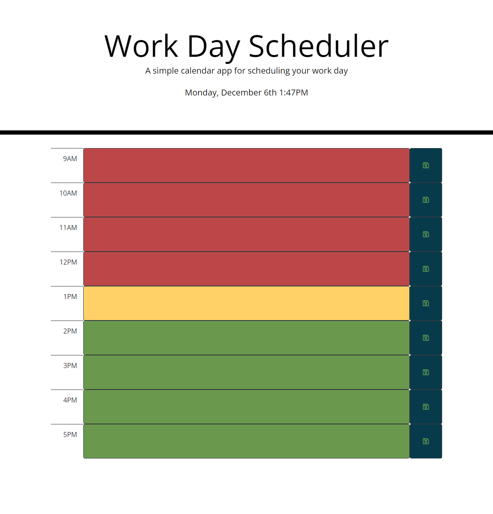

# Day-Scheduler

A daily planer that displays the current time and date at the top of the page, and timeblocks for each hour of a 9-5 work day.

Each timeblock can have tasks saved in the users local storage by using the save button on the right. Green is future, Yellow is present, and Red is past.

[github.com/Billygm/Day-Scheduler](https://github.com/Billygm/Day-Scheduler)

[billygm.github.io/Day-Scheduler/](https://billygm.github.io/Day-Scheduler/)